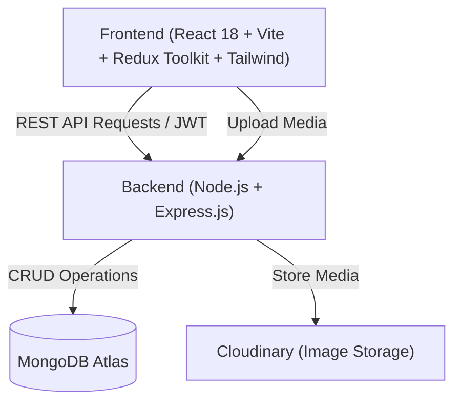

<div align="center">

# 📊 Polling App
### A Real-Time Full-Stack MERN Polling Platform

[](https://reactjs.org/)
[](https://redux-toolkit.js.org/)
[](https://nodejs.org/)
[](https://expressjs.com/)
[](https://www.mongodb.com/)
[](https://tailwindcss.com/)
[](https://vitejs.dev/)
[](https://opensource.org/licenses/MIT)

<p align="center">
  <b>Created & Maintained by <a href="https://github.com/rahulprakash0898">Rahul Prakash</a></b>
</p>

</div>

---

## 📖 Overview

**Polling App** is a feature-rich, full-stack real-time polling platform built on the **MERN stack (MongoDB, Express, React, Node.js)**. It enables users to create and explore a variety of poll formats — from single-choice and image comparisons to open-ended discussions and 5-star ratings. 

With built-in **Redux Toolkit** state management, responsive UI, bookmarking, and participation tracking, Polling App provides an intuitive, high-engagement community voting experience.

---

## 🎯 Problem Statement & Goals

Traditional polling tools are often static, rigid in question formats, and lack social engagement layers like personalized history tracking and bookmarks. 

### Key Goals:
- **Instant Vote Updates**: Dynamic percentage calculations and instant feedback upon vote submission.
- **Poll Format Diversity**: Support for 4+ poll types tailored for different questions.
- **User Engagement & History**: Dedicated sections for **My Polls**, **Voted Polls**, and **Bookmarks**.
- **Intuitive Discovery**: Clean dashboard with instant search, category filters, and infinite scroll.

---

## ✨ Features

### 🗳️ 4+ Specialized Poll Formats
1. **Single-Choice Polls**: Classic multiple-choice format with customizable options and live progress bars.
2. **Image-Based Polls**: Visual voting with image uploads powered by Cloudinary.
3. **Open-Ended Polls**: Discussion prompts where voters submit custom written responses.
4. **Yes / No Polls**: Quick binary decision polls with automated option setup.
5. **5-Star Rating Polls**: Interactive star-rating feedback with aggregated average metrics.

### 👤 User Profile & Personalization
- **Explore Feed**: Browse all public community polls with filter tags.
- **My Created Polls**: Manage your published polls (close active voting or delete polls).
- **Voted Polls**: Review your entire participation history.
- **Bookmarked Polls**: Save important polls to your personal bookmarks for quick access.
- **Stats Card**: Real-time counters showing total polls created, voted, and saved.

### 🛡️ Security & Performance
- **JWT Authentication**: Secure login and signup with `bcryptjs` password hashing.
- **Redux Toolkit (`@reduxjs/toolkit`)**: Predictable global state management.
- **Cloudinary Integration**: Direct, secure cloud image hosting.
- **Mobile Responsive**: Fully adaptive design built with Tailwind CSS.

---

## 🛠️ Tech Stack



| Component | Technology |
|---|---|
| **Frontend Framework** | React 18 with Vite |
| **State Management** | Redux Toolkit (`@reduxjs/toolkit`, `react-redux`) |
| **Styling** | Tailwind CSS & PostCSS |
| **Routing** | React Router v7 |
| **Icons & Notifications** | React Icons, React Hot Toast |
| **Backend Framework** | Node.js with Express.js |
| **Database** | MongoDB Atlas with Mongoose ODM |
| **Auth & Security** | JSON Web Tokens (JWT) & bcryptjs |
| **Cloud Storage** | Cloudinary & Multer |
| **Deployment** | Vercel (Monorepo / Serverless) |

---

## 📂 Database Schemas

### 1. User Schema
```javascript
{
  username: { type: String, required: true, unique: true },
  fullName: { type: String, required: true },
  email: { type: String, required: true, unique: true },
  password: { type: String, required: true },
  profileImageUrl: { type: String, default: "" },
  bookmarkedPolls: [{ type: mongoose.Schema.Types.ObjectId, ref: 'Poll' }]
}
```

### 2. Poll Schema
```javascript
{
  question: { type: String, required: true },
  type: {
    type: String,
    enum: ['single-choice', 'image-based', 'open-ended', 'yes/no', 'rating'],
    required: true
  },
  options: [{
    optionText: String,
    votes: { type: Number, default: 0 }
  }],
  response: [{
    voterId: { type: mongoose.Schema.Types.ObjectId, ref: 'User' },
    responseText: String,
    createdAt: { type: Date, default: Date.now }
  }],
  creator: { type: mongoose.Schema.Types.ObjectId, ref: 'User', required: true },
  voters: [{ type: mongoose.Schema.Types.ObjectId, ref: 'User' }],
  closed: { type: Boolean, default: false },
  createdAt: { type: Date, default: Date.now }
}
```

---

## 📡 API Endpoints

### 🔑 Authentication (`/api/v1/auth`)
| Method | Endpoint | Description | Auth |
|---|---|---|:---:|
| `POST` | `/api/v1/auth/register` | Register a new user account | ❌ |
| `POST` | `/api/v1/auth/login` | Login user & return JWT token | ❌ |
| `GET` | `/api/v1/auth/getUser` | Get current user profile and live stats | ✅ |

### 🗳️ Polls (`/api/v1/poll`)
| Method | Endpoint | Description | Auth |
|---|---|---|:---:|
| `POST` | `/api/v1/poll/create` | Create a new poll | ✅ |
| `GET` | `/api/v1/poll/getAllPolls` | Get all public polls with filters and pagination | ✅ |
| `GET` | `/api/v1/poll/votedPolls` | Get all polls voted by the logged-in user | ✅ |
| `GET` | `/api/v1/poll/user/bookmarked` | Get bookmarked polls of the logged-in user | ✅ |
| `GET` | `/api/v1/poll/:id` | Get poll details by ID | ✅ |
| `POST` | `/api/v1/poll/:id/vote` | Submit a vote or text response | ✅ |
| `POST` | `/api/v1/poll/:id/bookmark` | Toggle poll bookmark status | ✅ |
| `POST` | `/api/v1/poll/:id/close` | Close an active poll (creator only) | ✅ |
| `DELETE` | `/api/v1/poll/:id/delete` | Delete a poll (creator only) | ✅ |

### 🖼️ Media Uploads (`/api/upload`)
| Method | Endpoint | Description | Auth |
|---|---|---|:---:|
| `POST` | `/api/upload` | Upload image to Cloudinary and return secure URL | ❌ |

---

## ⚙️ Local Development Setup

### 1. Prerequisites
- Node.js (v18.0 or higher)
- MongoDB Database (Local instance or [MongoDB Atlas](https://www.mongodb.com/cloud/atlas))
- Cloudinary Account (for media uploads)

### 2. Clone the Repository
```bash
git clone https://github.com/rahulprakash0898/Polling-App.git
cd Polling-App
```

### 3. Backend Setup
```bash
cd backend
npm install
```

Create a `.env` file in the `backend/` directory:
```env
PORT=5000
NODE_ENV=development
MONGO_URI=mongodb+srv://<username>:<password>@<cluster>.mongodb.net/polling_app?retryWrites=true&w=majority
JWT_SECRET=your_secret_jwt_key
CLIENT_URL=http://localhost:5173
CLOUDINARY_CLOUD_NAME=your_cloudinary_cloud_name
CLOUDINARY_API_KEY=your_cloudinary_api_key
CLOUDINARY_API_SECRET=your_cloudinary_api_secret
```

Start the backend development server:
```bash
npm run dev
# Backend runs on: http://localhost:5000
```

### 4. Frontend Setup
In a new terminal:
```bash
cd frontend
npm install
```

Create a `.env` file in the `frontend/` directory:
```env
VITE_API_URL=http://localhost:5000
```

Start the Vite development server:
```bash
npm run dev
# Frontend runs on: http://localhost:5173
```

---

## 🚀 Vercel Deployment

This repository includes a root [vercel.json](./vercel.json) configured for full-stack monorepo deployment:

### Deploy Steps:
1. Import your GitHub repository to [Vercel](https://vercel.com).
2. Under **Environment Variables**, paste the following configuration:
   ```env
   MONGO_URI=your_mongodb_connection_string
   JWT_SECRET=your_jwt_secret_key
   CLIENT_URL=https://your-project.vercel.app
   CLOUDINARY_CLOUD_NAME=your_cloud_name
   CLOUDINARY_API_KEY=your_api_key
   CLOUDINARY_API_SECRET=your_api_secret
   VITE_API_URL=https://your-project.vercel.app
   NODE_ENV=production
   ```
3. Click **Deploy**. Vercel will build and deploy both the Vite frontend and the Express backend API automatically!

---

## 📄 License

This project is licensed under the **MIT License** — feel free to use and customize for your own projects.

---

<div align="center">
  <b>Developed with ❤️ by <a href="https://github.com/rahulprakash0898">Rahul Prakash</a></b>
</div>
